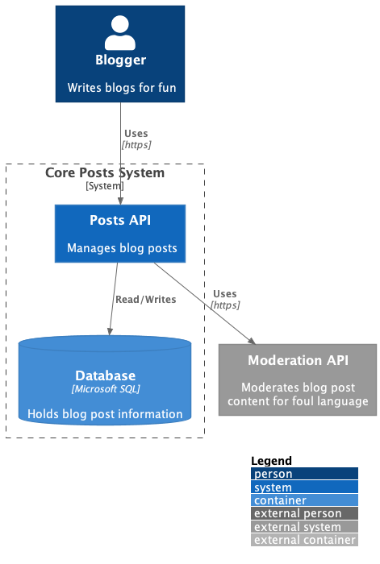

# Sprout AI Exercise

API that receives blog posts with the following content:

``` bash
$ curl -X 'POST' \
    'http://127.0.0.1:5000/posts/' \
    -H 'accept: application/json' \
    -H 'Content-Type: application/json' \
    -d '{
        "title": "This is an engaging title",
        "paragraphs": [
            "This is the first paragraph. It contains two sentences.",
            "This is the second parapgraph. It contains two more sentences",
            "Third paraphraph here."
        ]
    }'
```

Each sentence is run through a mock moderation ML model:

``` bash
$ curl -X 'POST' \
    'http://127.0.0.1:5000/sentences/' \
    -H 'accept: application/json' \
    -H 'Content-Type: application/json' \
    -d '{
        "fragment": "This is a sentence that might contain swear words.",
    }'
```
Returns: `{"hasFoulLanguage": false }`

Posts are stored in a "database" with the `hasFoulLanguage` flag

